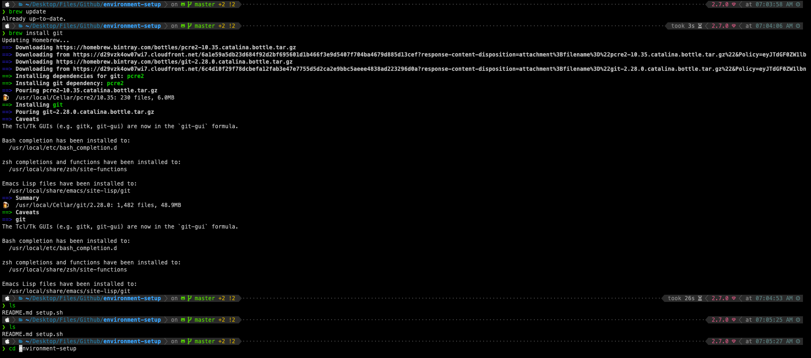

# Development Environment



### Description
A repository that host my development environment, and changes to it.

### Contents
1. Installation
2. Setup

### Installation
1. [iTerm2](https://iterm2.com/)
    * A terminal emulator that does amazing things
2. [Homebrew](https://brew.sh/)
    * Packet installer 

### Setup
1. [iTerm2](https://iterm2.com/)
    * A terminal emulator that does amazing things
1. Launch iTerm
2. Change shell to zsh 
    * ```$ chsh -s /bin/zsh```
3. Get O My Zsh
    * ```$ sh -c "$(curl -fsSL https://raw.github.com/robbyrussell/oh-my-zsh/master/tools/install.sh)"```
4. Clone Auto Suggestion Plugin
    * ```$ git clone https://github.com/zsh-users/zsh-autosuggestions $ZSH_CUSTOM/plugins/zsh-autosuggestions```
    * Enable the plugin the rc file ```$ vim ~/.zshrc```
    * Plugins line update to include this plug in ```plugins=(git zsh-autosuggestions)```
6. Clone Syntax Highlighting Plugin
    * ```$ git clone https://github.com/zsh-users/zsh-syntax-highlighting.git ${ZSH_CUSTOM:-~/.oh-my-zsh/custom}/plugins/zsh-syntax-highlighting```
    * Enable the plugin the rc file ```$ vim ~/.zshrc```
    * Update plugins ```$ plugins=(git zsh-autosuggestions zsh-syntax-highlighting)```
    * NOTE: Keep this plug in at the end
7. Install the latest CURL version
    * brew install curl
    * Set latest version to be used by defaulf in zshrc
        * `````$ echo 'export PATH="/usr/local/opt/curl/bin:$PATH"' >> ~/.zshrc`````
8. Install latest zsh version and set to default
    * ```$ brew install zsh```
    * ```$ echo 'export PATH="/usr/local/opt/ncurses/bin:$PATH"' >> ~/.zshrc```
9. Set Powerlevel10k as the theme
    * Clone repo:
        * ```$ git clone --depth=1 https://github.com/romkatv/powerlevel10k.git ${ZSH_CUSTOM:-$HOME/.oh-my-zsh/custom}/themes/powerlevel10k```
    * Update .zshrc file
        * Change from default ```ZSH_THEME="robbyrussell"``` To ```ZSH_THEME="powerlevel10k/powerlevel10k"```
    * Source ```$ source ~/.zshrc```
    * Customize it!  